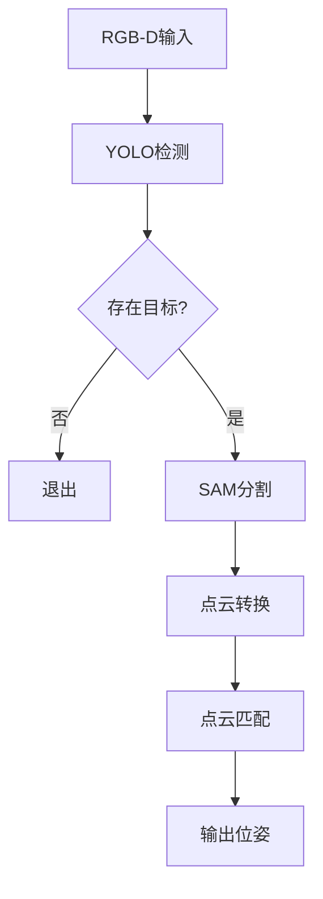

# 机器人抓取任务流程

## 输入
- RGB-D相机数据

## 处理流程

### 1. YOLO目标检测
**输入**: RGB图像  
**输出**: 边界框(BoundingBox)  
**处理**:
- 判断是否存在任务目标
  - 若无目标: 退出流程
  - 若有目标: 继续下一步

### 2. SAM分割
**输入**: RGB图像  
**输出**: 目标掩码(Mask)  

### 3. 点云处理
**输入**: Mask + Depth图像  
**输出**: 目标物体的部分点云数据

### 4. 点云匹配
**输入**: 
- 部分点云
- 预先存储的完整模型点云

**输出**: 
- 点云匹配变换矩阵

## 最终输出
相机坐标系下任务目标的位姿矩阵

## 处理流程图

--- 
--- 

# 视觉识别模块各个部分的详解
##  1. rgb-d信息采集
    调用API，进行rgb-d信息采集

--- 

## 2. rgb物品识别
    运用yolo+SAM识别出rgb图像中物体类别及其部分点云
    （可选）读取物品纹理信息作为物品附加属性

--- 

## 3. 点云匹配
    通过物品类别找到完整点云，根据物品部分点云信息得到转换矩阵（物品在相机坐标系下变换矩阵）

### PoseEstimation/pose_estimate.py文件
- 实现**PoseEstimator**类，通过部分点云匹配完整点云，输出完整点云转换到目标位姿的转换矩阵。
- Args: 部分点云变量，完整点云类别名称。
    - 对于部分点云，**必须**使用点云变量`o3d.geometry.PointCloud`
    - 对于完整点云，**必须**使用规范化的object类别名称（后面不带.ply），类别名称列表见`/workspace/SlowOutMen/VisionUnderstanding/PoseEstimation/obj_ply/`文件夹
- Returns: 完整点云转换到目标位姿的转换矩阵 `NDArray[float64]`
- Usage: 见文件PoseEstimation/pose_estimate.py的末尾`if __name__ == "__main__"`部分

--- 
